# Microservices Order Processing System

A production-grade, event-driven microservices system demonstrating advanced distributed system patterns including SAGA orchestration, event sourcing, idempotency, and distributed tracing.

## 🏗️ Architecture Overview

This system implements a choreography-based SAGA pattern for order processing with automatic compensation on failure.

### System Flow
```
User Request
    ↓
API Gateway (port 8080)
    ↓
Order Service (port 8081)
    ↓ (Kafka: order-created)
Inventory Service (port 8083)
    ↓ (Kafka: inventory-reserved)
Payment Service (port 8082)
    ↓ 
    ├─ Success → (Kafka: payment-success) → Order CONFIRMED ✅
    └─ Failure → (Kafka: payment-failed) → COMPENSATION: Release Inventory ❌
```

### Architecture Diagram
```
┌─────────────────────────────────────────────────────────────────────┐
│                          API Gateway (8080)                          │
│                     Single Entry Point / Routing                     │
└────────────────────────────────┬────────────────────────────────────┘
                                 │
                    ┌────────────┴────────────┐
                    │                          │
         ┌──────────▼──────────┐    ┌─────────▼────────┐
         │   Order Service     │    │  Notification    │
         │      (8081)         │    │   Service (8084) │
         │  ┌───────────────┐  │    └──────────────────┘
         │  │  orders (DB)  │  │              
         │  └───────────────┘  │
         └──────────┬──────────┘
                    │ order-created
                    ▼
         ┌──────────────────────┐
         │  Apache Kafka        │◄────────── Event Bus
         │  + Zookeeper         │
         └──────────┬───────────┘
                    │
        ┌───────────┴───────────┐
        │                       │
┌───────▼──────────┐    ┌──────▼─────────┐
│ Inventory Service│    │ Payment Service│
│     (8083)       │    │     (8082)     │
│ ┌──────────────┐ │    │ ┌────────────┐ │
│ │inventory_db  │ │    │ │payment_db  │ │
│ │- processed   │ │    │ │- processed │ │
│ │  _events     │ │    │ │  _events   │ │
│ └──────────────┘ │    │ └────────────┘ │
└──────────────────┘    └────────────────┘
```
## ✨ Key Features

### 1. **SAGA Pattern with Choreography**
- Distributed transaction management across microservices
- Automatic compensation on failure (inventory release)
- No central orchestrator - services react to events

### 2. **Idempotency**
- All services track processed events in database
- Prevents duplicate processing when Kafka redelivers messages
- Uses `processed_events` table with event_id as primary key

### 3. **State Machine Validation**
- Order states: `PENDING → PROCESSING → CONFIRMED/FAILED`
- Invalid state transitions rejected
- Ensures data consistency

### 4. **Distributed Tracing**
- Correlation IDs propagate through all events
- Complete request tracking across services
- Example: `corr-abc-123-def-456` flows through entire SAGA

### 5. **Event-Driven Architecture**
- Asynchronous communication via Apache Kafka
- Loose coupling between services
- Scalable and resilient

### 6. **Database-per-Service Pattern**
- Each service owns its data
- Independent scaling and deployment
- Service isolation

### 7. **Partition Keys**
- Kafka messages partitioned by order ID
- Guarantees event ordering per order
- Prevents race conditions

## 🛠️ Technology Stack

- **Java 21** - Modern Java LTS version
- **Spring Boot 3.2.1** - Application framework
- **Spring Cloud Gateway** - API Gateway
- **Apache Kafka** - Event streaming platform
- **PostgreSQL** - Primary database
- **Redis** - Caching (gateway)
- **Docker & Docker Compose** - Containerization
- **Lombok** - Code generation
- **Maven** - Build tool

## 📋 Prerequisites

- Docker Desktop installed
- Java 21 (for local development)
- Maven 3.9+ (for local development)
- 8GB RAM minimum

## 🚀 Quick Start

### 1. Start Infrastructure
```bash
# Clone the repository
git clone <your-repo-url>
cd order-processing-system

# Start all services
docker compose up -d

# Wait for services to be ready (30-60 seconds)
sleep 60

# Check all services are running
docker compose ps
```

### 2. Create an Order
```bash
# Create order (even ID = payment succeeds)
curl -X POST http://localhost:8081/api/orders \
  -H "Content-Type: application/json" \
  -d '{"customerName":"John Doe","totalAmount":200.00}'

# Create order (odd ID = payment fails, triggers compensation)
curl -X POST http://localhost:8081/api/orders \
  -H "Content-Type: application/json" \
  -d '{"customerName":"Jane Smith","totalAmount":199.00}'
```

### 3. View Logs
```bash
# Watch all services
docker compose logs -f

# Watch specific service
docker compose logs -f order-service

# Track request by correlation ID
docker compose logs | grep "corr-abc-123"
```

### 4. Query Database
```bash
# View orders
docker exec order-processing-system-postgres-1 \
  psql -U admin -d orders \
  -c "SELECT id, customer_name, state, total_amount FROM orders;"

# View processed events (idempotency)
docker exec order-processing-system-postgres-1 \
  psql -U admin -d inventory_db \
  -c "SELECT * FROM processed_events ORDER BY processed_at DESC LIMIT 10;"
```

## 🔄 SAGA Flow Examples

### Success Flow (Even Order ID)
```
1. Order Created (ID: 2, Amount: 200.00)
   State: PENDING → PROCESSING
   
2. OrderCreatedEvent published to Kafka
   Correlation ID: corr-abc-123-def-456
   
3. Inventory Service receives event
   → Reserves inventory
   → Publishes InventoryReservedEvent
   
4. Payment Service receives event
   → Processes payment (SUCCESS for even IDs)
   → Publishes PaymentSuccessEvent
   
5. Order Service receives PaymentSuccessEvent
   State: PROCESSING → CONFIRMED ✅
```

### Failure Flow with Compensation (Odd Order ID)
```
1. Order Created (ID: 3, Amount: 199.00)
   State: PENDING → PROCESSING
   
2. OrderCreatedEvent published to Kafka
   Correlation ID: corr-xyz-789-ghi-012
   
3. Inventory Service receives event
   → Reserves inventory
   → Publishes InventoryReservedEvent
   
4. Payment Service receives event
   → Processes payment (FAILURE for odd IDs)
   → Publishes PaymentFailedEvent
   
5. Inventory Service receives PaymentFailedEvent
   → COMPENSATION: Releases reserved inventory ↩️
   
6. Order Service receives PaymentFailedEvent
   State: PROCESSING → FAILED ❌
```

## 🧪 Testing Idempotency
```bash
# Test duplicate event handling
curl -X POST "http://localhost:8081/test/duplicate/orderId=999"

# Check logs - second event should be skipped
docker compose logs inventory-service | grep "Duplicate"

# Verify only one entry in database
docker exec order-processing-system-postgres-1 \
  psql -U admin -d inventory_db \
  -c "SELECT COUNT(*) FROM processed_events WHERE order_id = 999;"
```

## 📊 Database Schema

### Orders Database (order-service)
```sql
CREATE TABLE orders (
    id BIGSERIAL PRIMARY KEY,
    customer_name VARCHAR(255),
    total_amount DECIMAL(10,2),
    state VARCHAR(50)  -- PENDING, PROCESSING, CONFIRMED, FAILED
);
```

### Processed Events (inventory-service, payment-service)
```sql
CREATE TABLE processed_events (
    event_id VARCHAR(255) PRIMARY KEY,  -- Ensures idempotency
    order_id BIGINT,
    event_type VARCHAR(100),
    processed_at TIMESTAMP,
    consumer_service VARCHAR(50)
);
```

## 🏛️ Design Decisions

### Why Choreography over Orchestration?

**Chosen: Choreography (Event-Driven)**
- ✅ Loose coupling - services don't know about each other
- ✅ Scalability - easy to add new services
- ✅ Resilience - no central orchestrator failure point
- ❌ Harder to visualize complete flow
- ❌ Debugging requires correlation IDs

**Alternative: Orchestration (Central Coordinator)**
- ✅ Easier to understand flow
- ✅ Centralized monitoring
- ❌ Tight coupling
- ❌ Orchestrator becomes bottleneck

### Why Database-per-Service?

- Each service has complete ownership of its data
- Services can be deployed and scaled independently
- Different services can use different database technologies
- Prevents shared database anti-pattern

### Why Kafka over REST?

- **Asynchronous** - services don't wait for responses
- **Durable** - messages persisted, survives crashes
- **Scalable** - handles high throughput
- **Replayable** - can replay events for debugging
- **Decoupled** - publishers don't know consumers

### Why Correlation IDs?

- Track requests across all services
- Essential for debugging distributed systems
- Enables request tracing without complex tools
- Foundation for observability (Zipkin/Jaeger build on this)

## 📈 Monitoring & Observability

### Distributed Tracing

Every request generates a correlation ID that flows through all services:
```bash
# Extract correlation ID
CORR_ID=$(docker compose logs | grep "John Doe" | grep -oE 'corr-[a-f0-9-]+' | head -1)

# View complete request flow
docker compose logs | grep "$CORR_ID" | sort
```

Output shows:
```
order-service:     [corr-abc] Order created
inventory-service: [corr-abc] Inventory reserved
payment-service:   [corr-abc] Payment processed
order-service:     [corr-abc] Order confirmed
```

### Kafka Topics
```bash
# List topics
docker exec order-processing-system-kafka-1 \
  kafka-topics --bootstrap-server localhost:29092 --list

# Topics:
# - order-created
# - inventory-reserved  
# - payment-success
# - payment-failed
```

### Service Health
```bash
# Check all services
docker compose ps

# Check specific service logs
docker compose logs order-service | tail -50
```

## 🔧 Development

### Project Structure
```
order-processing-system/
├── docker-compose.yml
├── postgres-init/
│   └── init.sql                    # Database initialization
├── order-service/
│   ├── src/main/java/com/orderprocessing/orderservice/
│   │   ├── controller/             # REST endpoints
│   │   ├── entity/                 # JPA entities
│   │   ├── events/                 # Kafka events
│   │   ├── model/                  # Domain models (OrderState)
│   │   ├── repository/             # Database repositories
│   │   └── service/                # Business logic
│   └── pom.xml
├── inventory-service/
│   └── ... (similar structure)
├── payment-service/
│   └── ... (similar structure)
├── notification-service/
│   └── ... (similar structure)
└── gateway/
    └── ... (similar structure)
```

### Building Services
```bash
# Build all services
docker compose build

# Build specific service
docker compose build order-service

# Rebuild without cache
docker compose build --no-cache order-service
```

### Running Locally (Development)
```bash
# Start infrastructure only
docker compose up -d zookeeper kafka postgres redis

# Run service locally (in IDE or command line)
cd order-service
mvn spring-boot:run
```

## 🐛 Troubleshooting

### Services Won't Start
```bash
# Check logs for errors
docker compose logs order-service

# Restart specific service
docker compose restart order-service

# Rebuild and restart
docker compose build order-service
docker compose up -d order-service
```

### Kafka Connection Issues
```bash
# Ensure proper startup order
docker compose down
docker compose up -d zookeeper
sleep 10
docker compose up -d kafka
sleep 30
docker compose up -d
```

### Database Connection Issues
```bash
# Check PostgreSQL is running
docker compose ps postgres

# Check database exists
docker exec order-processing-system-postgres-1 psql -U admin -l

# Recreate databases
docker compose down -v
docker compose up -d
```

## 📚 Learning Resources

- [SAGA Pattern](https://microservices.io/patterns/data/saga.html)
- [Event-Driven Architecture](https://martinfowler.com/articles/201701-event-driven.html)
- [Idempotency in Microservices](https://www.baeldung.com/cs/idempotent-operations)
- [Apache Kafka Documentation](https://kafka.apache.org/documentation/)

## 🎯 Interview Talking Points

### 1. How do you handle distributed transactions?

"I implemented the SAGA pattern with choreography. Each service publishes events after completing its local transaction. If any step fails, compensation events are triggered. For example, if payment fails, a PaymentFailedEvent triggers inventory release."

### 2. How do you prevent duplicate processing?

"I use idempotency keys stored in a `processed_events` table. Each event has a unique UUID. Before processing, services check if they've seen that event ID. If yes, they skip processing. This handles Kafka's at-least-once delivery guarantee."

### 3. How do you track requests across microservices?

"I use correlation IDs that propagate through all events. When order-service creates an order, it generates a UUID that flows through inventory-service, payment-service, and back. This enables complete request tracing in logs and forms the foundation for tools like Zipkin."

### 4. Why Kafka instead of synchronous REST calls?

"Kafka provides asynchronous, durable, and scalable communication. Services don't wait for responses, messages survive crashes, and we can replay events. It naturally supports the event-driven architecture and makes the system more resilient."

### 5. How do you ensure data consistency?

"Through a combination of state machines, idempotency, and the SAGA pattern. State machines prevent invalid transitions, idempotency prevents duplicate processing, and SAGA ensures either all steps complete or we compensate."

## 📄 License

This is a portfolio/learning project.

## 👤 Author
shrewd !!!

---

**Built with ❤️ to showcase microservices architecture patterns**


# System Architecture: Create Architecture Diagram

## High-Level Architecture


## SAGA Flow - Success Scenario


## SAGA Flow - Failure with Compensation

```mermaid
sequenceDiagram
    participant User
    participant Order as Order Service
    participant Kafka
    participant Inventory as Inventory Service
    participant Payment as Payment Service
    
    User->>Order: POST /api/orders
    Note over Order: State: PENDING
    Order->>Order: Save order
    Order->>Kafka: OrderCreatedEvent<br/>(corr-xyz-789)
    Note over Order: State: PROCESSING
    
    Kafka->>Inventory: OrderCreatedEvent
    Inventory->>Inventory: Reserve inventory ✅
    Inventory->>Kafka: InventoryReservedEvent<br/>(corr-xyz-789)
    
    Kafka->>Payment: InventoryReservedEvent
    Payment->>Payment: Process payment ❌
    Payment->>Kafka: PaymentFailedEvent<br/>(corr-xyz-789)
    
    Kafka->>Inventory: PaymentFailedEvent
    Note over Inventory: COMPENSATION
    Inventory->>Inventory: Release inventory ↩️
    
    Kafka->>Order: PaymentFailedEvent
    Note over Order: State: FAILED
    Order-->>User: Order failed
```


## State Machine


## Idempotency Pattern


## Distributed Tracing


## Database-per-Service Pattern


## Simplified Architecture Diagrams

# System Architecture

## Simple System Overview
```
┌─────────┐
│  User   │
└────┬────┘
     │
     ▼
┌─────────────────┐
│   API Gateway   │  (Entry point)
└────┬────────────┘
     │
     ▼
┌─────────────────┐         ┌──────────────────┐
│ Order Service   │◄────────┤ PostgreSQL       │
│                 │         │ (orders database)│
└────┬────────────┘         └──────────────────┘
     │
     │ (publishes events)
     ▼
┌─────────────────┐
│  Apache Kafka   │  (Event Bus - message broker)
└────┬───┬───┬────┘
     │   │   │
     │   │   └──────────┐
     │   │              │
     ▼   ▼              ▼
┌─────────┐  ┌─────────┐  ┌──────────────┐
│Inventory│  │ Payment │  │Notification  │
│ Service │  │ Service │  │   Service    │
└────┬────┘  └────┬────┘  └──────────────┘
     │            │
     ▼            ▼
┌─────────┐  ┌─────────┐
│inventory│  │payment  │
│   _db   │  │  _db    │
└─────────┘  └─────────┘
```

---

## Success Flow: Order Approved ✅

**What happens when an order succeeds:**
```
Step 1: User creates order
   ↓
Step 2: Order Service
   • Creates order (state: PENDING)
   • Publishes "OrderCreated" event to Kafka
   • Changes state to PROCESSING
   ↓
Step 3: Inventory Service (listening to Kafka)
   • Receives "OrderCreated" event
   • Reserves inventory
   • Publishes "InventoryReserved" event
   ↓
Step 4: Payment Service (listening to Kafka)
   • Receives "InventoryReserved" event
   • Processes payment ✅ SUCCESS
   • Publishes "PaymentSuccess" event
   ↓
Step 5: Order Service (listening to Kafka)
   • Receives "PaymentSuccess" event
   • Changes order state to CONFIRMED ✅
   • Order complete!
```

---

## Failure Flow: Order Rejected with Compensation ❌

**What happens when payment fails:**
```
Step 1-3: Same as above
   (Order created, inventory reserved)
   ↓
Step 4: Payment Service
   • Receives "InventoryReserved" event
   • Processes payment ❌ FAILED
   • Publishes "PaymentFailed" event
   ↓
Step 5: Inventory Service (COMPENSATION)
   • Receives "PaymentFailed" event
   • Releases reserved inventory ↩️
   • Compensates for the failure
   ↓
Step 6: Order Service
   • Receives "PaymentFailed" event
   • Changes order state to FAILED ❌
   • Order rejected
```

---

## Order States (State Machine)

**Valid transitions:**
```
PENDING ────────────┐
   │                │
   │ (submit)       │ (cancel)
   ▼                ▼
PROCESSING      CANCELLED ✅
   │
   ├─ (payment success)
   │         ↓
   │    CONFIRMED ✅
   │
   └─ (payment failed)
            ↓
         FAILED ❌

✅ = Terminal state (end of flow)
```

**Invalid transitions (blocked by state machine):**
- ❌ CONFIRMED → PENDING (can't go backwards)
- ❌ FAILED → CONFIRMED (can't change failed order)
- ❌ PENDING → CONFIRMED (must go through PROCESSING)

---

## How Idempotency Works

**Problem:** Kafka might deliver the same message twice

**Solution:** Track what we've already processed
```
┌─────────────────────────────────────────┐
│ processed_events table                  │
├──────────────────┬──────────────────────┤
│ event_id         │ processed_at         │
├──────────────────┼──────────────────────┤
│ abc-123          │ 2026-01-23 10:30:00  │
│ def-456          │ 2026-01-23 10:30:05  │
└──────────────────┴──────────────────────┘
```

**When event arrives:**
```
1. New event arrives: event_id = "abc-123"
   ↓
2. Check: Is "abc-123" in processed_events table?
   ↓
   ├─ NO  → Process it, then save "abc-123" to table ✅
   │
   └─ YES → Skip it! Already processed before 🔁
```

**Example:**
```
First time:  Event "abc-123" → Not in table → Process ✅
Second time: Event "abc-123" → Already in table → Skip 🔁
Third time:  Event "abc-123" → Already in table → Skip 🔁
```

---

## Distributed Tracing with Correlation IDs

**Problem:** How do you track one order across all services?

**Solution:** Each order gets a unique correlation ID
```
Order 5 created → correlation ID: corr-2f6968f8-6b24-4fe4-8f33-d97e5d9ecece

This ID flows through ALL services:

order-service:     [corr-2f6968f8...] Order 5 created
inventory-service: [corr-2f6968f8...] Inventory reserved for order 5
payment-service:   [corr-2f6968f8...] Payment failed for order 5
inventory-service: [corr-2f6968f8...] Releasing inventory for order 5
order-service:     [corr-2f6968f8...] Order 5 failed
```

**How to use:**
```bash
# Find all logs for one order by correlation ID
docker compose logs | grep "corr-2f6968f8"

# Shows complete journey of that one order across all services!
```

---

## Key Technologies
```
┌────────────────┬─────────────────────────────────────┐
│ Technology     │ Purpose                             │
├────────────────┼─────────────────────────────────────┤
│ Spring Boot    │ Build each microservice             │
│ Apache Kafka   │ Message broker (event bus)          │
│ PostgreSQL     │ Store data (separate DB per service)│
│ Docker         │ Run everything in containers        │
│ API Gateway    │ Single entry point for all requests │
└────────────────┴─────────────────────────────────────┘
```

---

## Why This Architecture?

### Event-Driven (Kafka)
**Instead of:** Service A calls Service B directly (REST)
**We use:** Service A publishes event → Kafka → Service B listens
**Benefit:** Services don't need to know about each other

### SAGA Pattern
**Instead of:** One big database transaction across all services
**We use:** Each service does its own transaction + compensation if needed
**Benefit:** Works in distributed systems where one transaction can't span multiple databases

### Idempotency
**Instead of:** Process every message even if duplicate
**We use:** Check if already processed, skip duplicates
**Benefit:** Safe even when Kafka delivers same message twice

### Database-per-Service
**Instead of:** All services share one database
**We use:** Each service has its own database
**Benefit:** Services can scale independently

---

## Quick Start
```bash
# 1. Start everything
docker compose up -d

# 2. Wait 60 seconds for startup
sleep 60

# 3. Create an order (payment will succeed for even amounts)
curl -X POST http://localhost:8081/api/orders \
  -H "Content-Type: application/json" \
  -d '{"customerName":"Test User","totalAmount":200.00}'

# 4. Watch the flow
docker compose logs -f
```

---

## Common Questions

**Q: What happens if a service crashes?**
A: Kafka stores the messages. When service restarts, it processes messages it missed.

**Q: What if Kafka delivers same message twice?**
A: Idempotency handles it - we check if we already processed that event ID.

**Q: How do you track one order across services?**
A: Correlation IDs - one unique ID flows through entire system in every log message.

**Q: What if payment fails?**
A: SAGA pattern triggers compensation - inventory gets released automatically.

**Q: Can services be deployed independently?**
A: Yes! Each service has its own code, database, and can be deployed separately.


